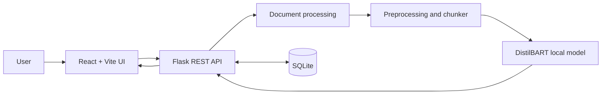
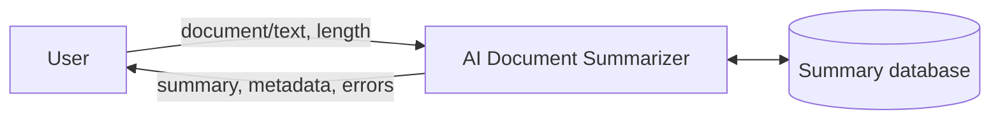
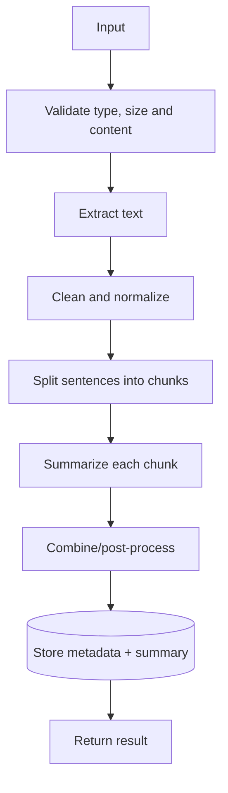
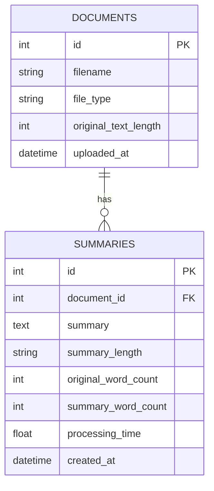
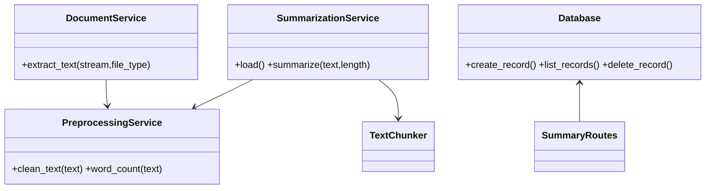

# System architecture

```mermaid
flowchart LR
 U[User] --> R[React + Vite UI] --> A[Flask REST API]
 A --> D[Document processing]
 D --> P[Preprocessing and chunker]
 P --> M[DistilBART local model]
 M --> A
 A <--> S[(SQLite)]
 A --> R
```

## DFD level 0

```mermaid
flowchart LR
User -->|document/text, length| System[AI Document Summarizer]
System -->|summary, metadata, errors| User
System <--> Database[(Summary database)]
```

## DFD level 1 and flow

```mermaid
flowchart TD
I[Input] --> V[Validate type, size and content] --> E[Extract text]
E --> C[Clean and normalize] --> K[Split sentences into chunks]
K --> N[Summarize each chunk] --> J[Combine/post-process]
J --> DB[(Store metadata + summary)] --> O[Return result]
```

## ER diagram

```mermaid
erDiagram
 DOCUMENTS ||--o{ SUMMARIES : has
 DOCUMENTS { int id PK string filename string file_type int original_text_length datetime uploaded_at }
 SUMMARIES { int id PK int document_id FK text summary string summary_length int original_word_count int summary_word_count float processing_time datetime created_at }
```

## Class/module view

```mermaid
classDiagram
 class DocumentService { +extract_text(stream,file_type) }
 class PreprocessingService { +clean_text(text) +word_count(text) }
 class SummarizationService { +load() +summarize(text,length) }
 class Database { +create_record() +list_records() +delete_record() }
 DocumentService --> PreprocessingService
 SummarizationService --> PreprocessingService
 SummarizationService --> TextChunker
 Database <-- SummaryRoutes
```
